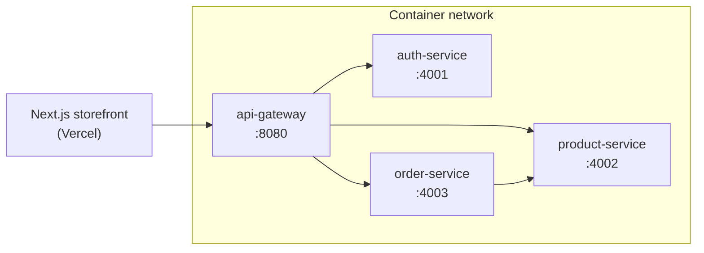
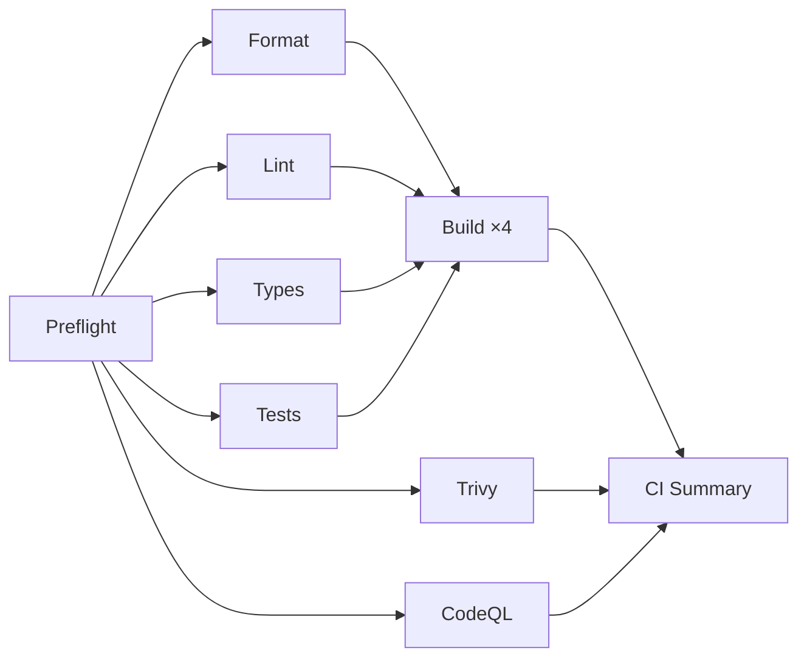
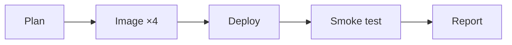

# ecom-microservices

[](https://github.com/dollarsmoney/Piple-lines-Deployment-/actions/workflows/ci.yml)
[](https://github.com/dollarsmoney/Piple-lines-Deployment-/actions/workflows/cd.yml)
[](https://github.com/dollarsmoney/Piple-lines-Deployment-/security/code-scanning)
[](https://nodejs.org)
[](#license)

An e-commerce demo built as four Node/TypeScript services behind an API gateway,
with a Next.js + shadcn/ui storefront.

---

## Architecture



The gateway is the only service published to the host. Everything else is
reachable only on the internal network, so its auth and rate limiting cannot be
bypassed. `order-service` calls `product-service` directly to price a cart.

| Workspace | Package | Role |
| --- | --- | --- |
| `services/gateway` | `@ecom/api-gateway` | Routing, JWT verification, CORS, rate limiting |
| `services/auth-service` | `@ecom/auth-service` | Registration, login, JWT issuance |
| `services/product-service` | `@ecom/product-service` | Catalogue reads and search |
| `services/order-service` | `@ecom/order-service` | Carts and checkout |
| `packages/shared` | `@ecom/shared` | Shared types and Zod schemas |
| `packages/service-kit` | `@ecom/service-kit` | Express app factory, logging, `/health` |
| `web` | `@ecom/web` | Next.js storefront |

---

## Pipelines

### CI — `.github/workflows/ci.yml`

Runs on every push and pull request to `main`.



The stages are separate jobs rather than steps in one job, which means the
Actions run graph names whichever check failed and the six checks in the middle
row run in parallel. Every job writes a panel to the run summary, and the final
**CI Summary** job renders one table of all results plus the coverage numbers.

| Stage | What it enforces |
| --- | --- |
| Preflight | Dependencies install cleanly; warms the shared npm cache |
| Format | `prettier --check` across the repo |
| Lint | `eslint .` |
| Types | `tsc --noEmit` in every workspace |
| Tests | Vitest suite; coverage gated at 55% by `vitest.config.ts` |
| Trivy | Fails on fixable CRITICAL/HIGH CVEs; suppressions in `.trivyignore` |
| CodeQL | Semantic analysis published to the Security tab |
| Build | Compiles each of the four services on its own matrix leg |

### CD — `.github/workflows/cd.yml`



| Trigger | Environment | Image tag |
| --- | --- | --- |
| Push to `main` | `staging` | Short commit SHA |
| Push tag `v*.*.*` | `production` | The version tag |
| Manual dispatch | Your choice | Your input, or `latest` |

Images are built for `linux/amd64` and `linux/arm64` and pushed to Docker Hub.
Deployment is a rolling `kubectl set image` per service followed by a blocking
`rollout status`, then a smoke test that probes the gateway's `/health`
endpoint — because a completed rollout only proves the pods started, not that
the stack is actually serving.

Production is gated on a GitHub Environment, so you can require manual approval
under **Settings → Environments**.

### AI failure reporter — `.github/workflows/ai-pipeline-reporter.yml`

When CI or CD fails, this workflow pulls the failed job logs, asks an LLM to
diagnose them, and posts the result as a PR or commit comment.

### Required secrets

| Secret | Used by | Purpose |
| --- | --- | --- |
| `DOCKERHUB_USERNAME` | CD | Registry account, also the image prefix |
| `DOCKERHUB_TOKEN` | CD | Registry access token, not the password |
| `KUBE_CONFIG` | CD | base64-encoded kubeconfig |
| `OPENAI_API_KEY` | AI reporter | Log diagnosis |
| `SLACK_WEBHOOK_URL` | CD, AI reporter | Optional; those steps skip if unset |

---

## Local development

Requires Node >= 22.

```bash
npm install
npm run dev
```

That builds the shared packages and starts all four services plus the storefront
with colour-coded, interleaved logs. The storefront is on `http://localhost:3000`
and the gateway on `http://localhost:8080`.

### With Docker

```bash
cp .env.example .env
npm run docker:up
```

Brings up the four backend services; the gateway is published on `:8080`. The
storefront is not containerised — it is deployed by Vercel — so run it with
`npm run dev:web` alongside the stack.

```bash
npm run docker:down
```

### Checks

```bash
npm run format:check   # Prettier
npm run lint           # ESLint
npm run typecheck      # tsc --noEmit, all workspaces
npm run test           # Vitest
npm run test:coverage  # Vitest with a coverage report
```

These are exactly what CI runs, so a clean local pass means a clean pipeline.

---

## Notes

**The lockfile is regenerated in CI and in Docker builds.** `package-lock.json`
is generated on Windows and therefore omits the Linux-only optional binaries
(`@tailwindcss/oxide`, `@next/swc-linux-*`). Installing from it directly on
Ubuntu produces native binding errors, so both the CI setup action and the
service Dockerfiles run `npm install` rather than `npm ci`.

**Docker build context is the repository root.** This is an npm-workspaces
monorepo and each service compiles against the built output of `@ecom/shared`
and `@ecom/service-kit`, so a service directory alone is not a sufficient
context. Build with `-f services/<name>/Dockerfile .`.

## License

MIT
